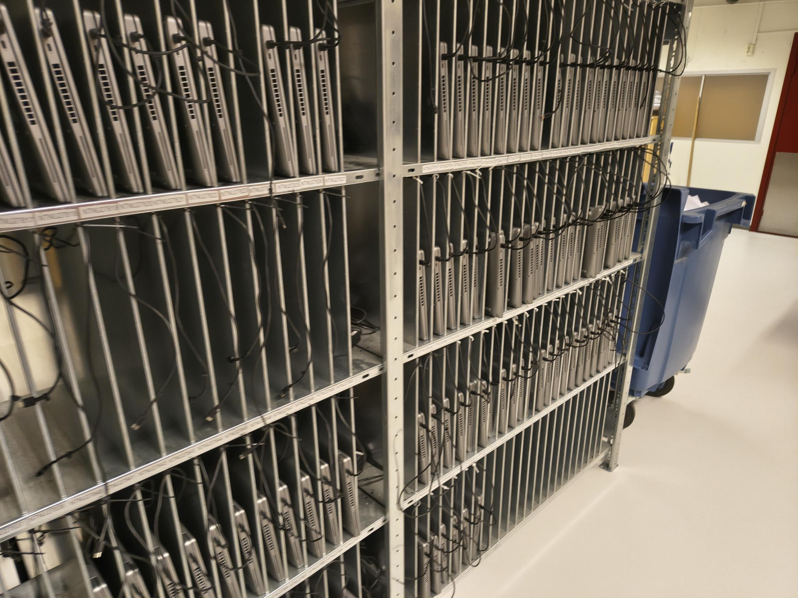

<h2>Tirsdag - uke 6</h2>

**08:15 - 15:15**

På starten av dagen var det ikke så mye å gjøre. Noen hadde møter, mens andre 
hadde ikke noe spesielt som skulle gjøres. Etterhvert sjekket vi på de bærbare 
datamaskinene for å se at de hadde Windows 11 og all programvare var installer.
Noe av programvaren ble ikke nedlastet korrekt, så vi måtte reboote dem på nytt. 
Etterpå flyttet vi alle laptopene ned til lageret hvor de ble satt på lading.
Jeg hørte på de andre snakke om et system hvor de kan bippe inn ting som tegnebrett
når det lånes ut for å ha oversikt over hvilken sone det befinner seg i.

</img>

**Refleksjon:**

Det kan ofte variere hvor mye det er som skal gjøres på en arbeidsplass. 
I dag var det ikke så mye for meg å gjøre og jeg ble sittende for meg selv 
for mesteparten av tiden. Da er det viktig at man finner noe annet å gjøre,
som å fullføre kurs eller utforske relevante nyheter eller teknologier. Det 
var fortsatt greit å være der. De på arbeidsplassen tok meg med på enkelte
ting som skulle gjøres. Det ble diskutert ulike forbedringer for dokumentasjon 
og system for å unngå at maskinvare mistes og at man vet hvor ting er.
