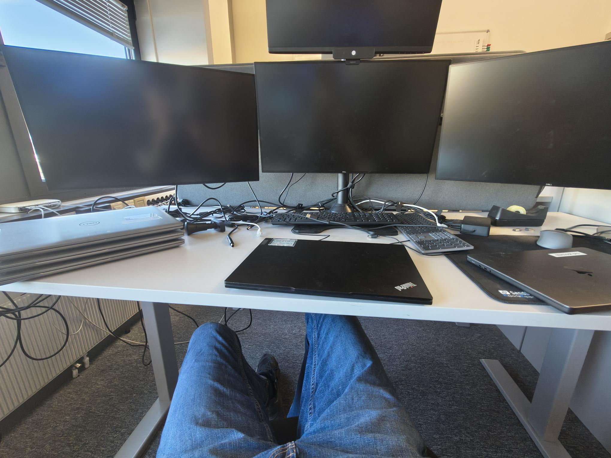

<h2>Torsdag uke 6 - NTNU Eksamensbygget, Sluppen</h2>

**08:50 - 14:30**

Enda et møte i dag. Denne gangen var det med oss og en plass i Ålesund. Det var
flere laptopper som måtte tankes. Jeg fikk se litt på hvordan AD oppsettet var
strukturert og satt opp. Jeg ble også vist hvordan man kan lage KI-agenter for å
gi relevante svar ved å få agenten til å bruke bestemte kilder og instrukser.

**Refleksjon:**

Dette var siste dagen jeg skulle være på NTNU eksamensbygget. I dag føler jeg at 
jeg fikk lært litt mer bare ved å snakke med de på jobben. Det var fortsatt ikke
alt for mye for meg å gjøre, men jeg syntes det var kult å se på AD oppsettet. De
har så mange pc-er i systemet at man må gå ganske dypt inn i OU-ene for å finne den
rette pc-en. 