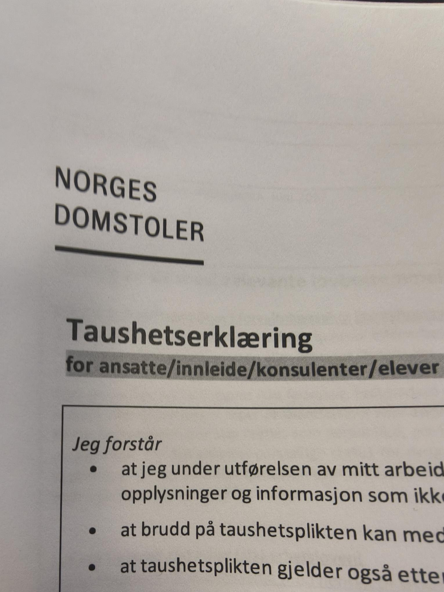

<h2>Mandag uke 7 - Domstoladministrasjonen</h2>

**09:00 - 15:45**

Fikk en omvisning av arbeidsplassen hvor jeg fikk se første, andre og sjetteetasje,
og noen lagerrom i kjelleren. Vi sitter i andreetasje. Jeg fikk se på backloggen til 
en av lærlingene som jobbet der, hvor jeg så gjennom og var med å gjøre ferdig noen
av oppgavene. Senere så vi også gjennom kursmateriell for å se om det var oppdatert.
Endte opp med å oppdatere en guide som hadde bilder fra Windows 10. Måtte signere en 
taushetserklæring.

Det var en ticket maskin som var ødelagt og blinket rødt. Endte opp med å være en 
ganske enkel løsning med å bare skru den av og på igjen.

**Refleksjon:**

Førsteinntrykket mitt av arbeidsplassen er at det potensielt kan være en veldig god
mulighet for å bli lærling. De er veldig god på å ta inn og følge opp lærlinger, og
det virker som om man ofte har noe å gjøre. Ellers var det et godt sosialt miljø
og det var greit å snakke med kollegaene som satt i nærheten. Det virket som om det
var nok arbeidsoppgaver og vi har allerede planer for ting som skal gjøres senere i
uka.