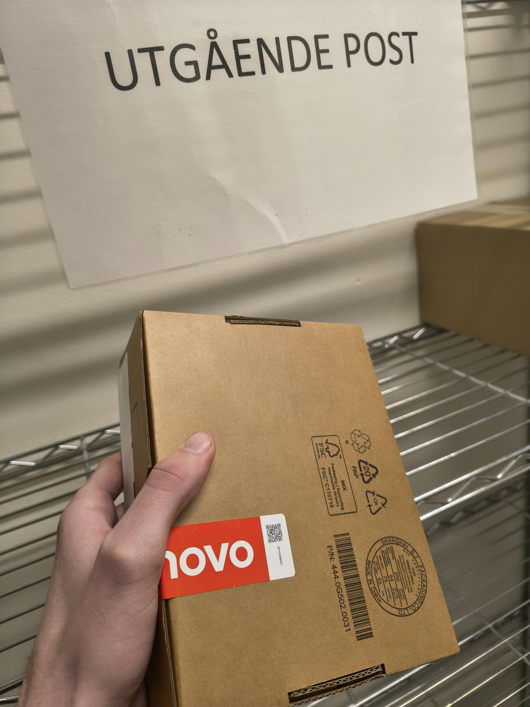

<h2>Tirsdag uke 7 - Domstoladministrasjonen</h2>

**08:00 - 15:45**

Har sittet med de to lærlingene hele dagen og gjort ting sammen med dem. Fikk et 
headset for å lytte inn på hver gang noen ringte inn for å få brukerstøtte. Fikk
være med å gjøre ulike bestillinger for ansatte som melder inn at de trenger utstyr.
Det var en ticketmaskin som manglet fyll og jeg var med å bytte det. Pakket inn to
pakker med utstyr for å sendes videre. 

Var flere oppgaver fra lærlingene som jeg fikk
være med å gjennomføre. Var med på et møte med hele brukerstøttegjengen hvor det ble
gått gjennom noen av de større sakene som hadde blitt meldt inn i det siste.

**Refleksjon:**

Jeg synes det har vært veldig interessant å kunne være med å lytte på samtaler og 
løsninger med kunden, og fikk et innblikk i hvordan problemløsningsprosessen foregikk.
De har maler klare for kjente problemer som er lett tilgjengelig og fungerer som en 
guide for å løse problemet. Det er kult å få være med på bestillinger av utstyr. Møtet
var litt kjedelig, men det var ikke så ille.